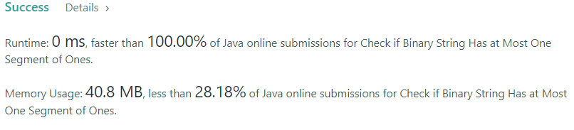

# Check if Binary String Has at Most One Segment of Ones

### Task: 

Given a binary string s without leading zeros, return true if s contains at most one contiguous segment 
of ones. Otherwise, return false.

### Example 1:

Input: s = "1001"
Output: false
Explanation: The ones do not form a contiguous segment.

### Example 2:

Input: s = "110"
Output: true

### Result: 

The time complexity of this algorithm is O(N). And the same algorithm for memory.
